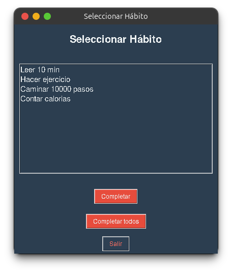
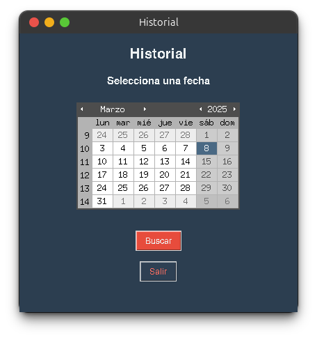

# Easy Habit Tracker

## Descripción
**Easy Habit Tracker** es una aplicación de escritorio desarrollada en Python con una interfaz basada en Tkinter, diseñada para ayudar a los usuarios a realizar un seguimiento de sus hábitos diarios de manera sencilla y efectiva. Con esta aplicación, puedes añadir nuevos hábitos, marcar su progreso, visualizar tu avance diario o por en fechas anteriores y eliminar aquellos que ya no desees rastrear.

---

## Características
- **Añadir nuevos hábitos**: Registra los hábitos que deseas seguir de forma rápida y sencilla.
- **Actualizar el estado de los hábitos**: Marca tus hábitos como "Completados" cuando los termines.
- **Ver progreso diario**: Visualiza el estado actual de todos los hábitos.
- **Eliminar hábitos**: Elimina hábitos del rastreador cuando ya no sean necesarios.
- **Ver historial**: Permite ver el progreso de hábitos en días pasados
- **Interfaz simple y amigable**: Navega a través del menú principal con facilidad.

---

## Tecnologías utilizadas
- **Lenguaje:** Python
- **Librerías:**
  - `datetime`: Para mostrar la fecha actual
  - `tkinter`: Para la interfaz gráfica
  - `tkcalendar`: Para el calendarío en la sección "Ver Historial"

---

## Requisitos previos

Antes de ejecutar la aplicación, asegúrate de tener Python 3 instalado en tu sistema. Además, necesitas instalar las siguientes librerías:

```bash
pip install tkcalendar
```
---

## Instalación
1. Clona este repositorio:
   ```bash
   git clone https://github.com/jrramoncp/Easy-Habit-Tracker.git
   ```
2. Navega al directorio del proyecto:
   ```bash
   cd Easy-Habit-Tracker
   ```
3. Ejecuta el script principal:
   ```bash
   python tracker.py
   ```

---
## Estructura del Proyecto

El proyecto está compuesto por los siguientes archivos:

- **tracker.py**: Interfaz gráfica de la aplicación.
- **data_manager.py**: Módulo encargado de la gestión de datos y almacenamiento en JSON.
- **habitos.json**: Archivo que almacena el historial de hábitos (se crea al iniciar el programa por primera vez).

---

## Cómo usar
1. Al iniciar el programa, se mostrará el menú principal.
2. Escribe un hábito en el cuadro de texto para añadirlo al seguimiento.
3. Selecciona "Completar hábito" o "Eliminar hábito", para gestionar tus hábitos
4. Elige 'Ver Progreso' o 'Ver Historial' para ver tu progreso actual o consultar una fecha anterior.
5. Elige "Salir" para cerrar la aplicación.

---

## Capturas de pantalla
**Menú Principal**


**Agregar Hábito**


**Completar Hábito**



**Eliminar Hábito**


**Ver Progreso Actual**


**Ver Historial**



---

## Contribución
Si deseas contribuir a este proyecto, no dudes en realizar un fork del repositorio y enviar tus pull requests.

---

## Autor
**Jose Ramón Caravaca**  
[GitHub](https://github.com/jrramoncp) | [Email](mailto:joseramoncaravaca@gmail.com) | [Instagram](https://www.instagram.com/jrramoncp)

---

## Licencia
Este proyecto está licenciado bajo la MIT License. Consulta el archivo `LICENSE` para más información.